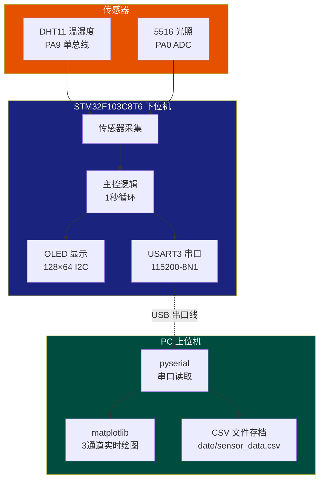
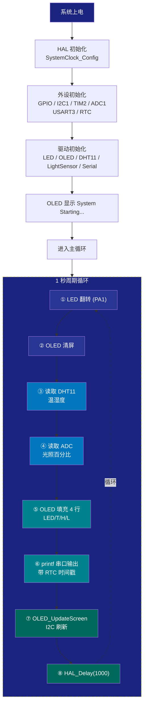
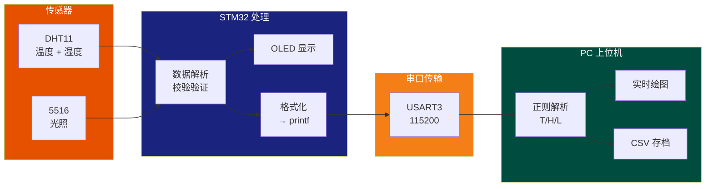

# STM32 智能环境采集终端 — PPT 生成指令

> 请将此文档提供给 AI PPT 生成工具，用于生成一份约 15 页的项目汇报演示文稿。

---

## 基本要求

- **PPT 主题**：STM32 智能环境采集终端
- **页数**：约 15 页
- **风格**：科技蓝 / 深色系，工科答辩风格
- **内容侧重**：项目整体架构、硬件方案、软件设计、数据分析、项目亮点

---

## 每页内容大纲

### 第1页 — 封面

**标题**：STM32 智能环境采集终端
**副标题**：基于 STM32F103C8T6 + Python 双端协同的实时环境监测系统
**底部信息**：2026年7月 | 嵌入式系统设计

---

### 第2页 — 项目背景与目标

**项目背景**：
- 物联网时代对环境参数的实时监测需求日益增长
- 传统方案存在数据不透明、无法远程追溯的问题
- 需要一套兼顾现场显示与 PC 端数据管理的低成本方案

**项目目标**：
- 实现温湿度、光照强度的实时采集与本地显示
- 通过串口将数据实时传输至 PC 端进行可视化监控
- 建立 CSV 数据存档，支持历史数据追溯分析
- 构建低成本、高可靠、易扩展的嵌入式监测终端

---

### 第3页 — 系统整体架构

**系统框图描述**：

- **下位机（STM32F103C8T6）**
  - 传感器数据采集（DHT11 温湿度 + 5516 光照）
  - OLED 本地实时显示（4行信息）
  - USART 串口上传数据
  - 主控核心：Cortex-M3 @ 72MHz

- **上位机（Python / PC）**
  - pyserial 串口通信
  - matplotlib 三通道实时绘图
  - CSV 文件数据持久化

**通信方式**：USART3 串口，115200-8N1，USB-Serial 桥接

---

### 第4页 — 硬件方案总览

**主控芯片**：STM32F103C8T6

| 参数 | 规格 |
|------|------|
| 内核 | Cortex-M3 @ 72MHz |
| Flash | 64 KB |
| RAM | 20 KB |
| 工作电压 | 2.0V - 3.6V |

**外设资源使用**：

| 外设 | 引脚 | 连接设备 |
|------|------|---------|
| GPIO | PA1 | LED 指示灯 |
| GPIO | PA9 | DHT11 温湿度传感器 |
| ADC1 | PA0 | 5516 光敏传感器 |
| I2C1 | PB8(SCL)/PB9(SDA) | OLED 128×64 显示屏 |
| USART3 | PB10(TX)/PB11(RX) | CH340 串口模块 |
| TIM2 | 内部 | 微秒级延时发生器 |
| RTC | LSI | 实时时钟 |

---

### 第5页 — 系统时钟树

**时钟架构**：

```
HSE 8MHz 外部晶振
  ↓ PLL ×9
SYSCLK 72MHz
  ├── AHB (HCLK) = 72MHz
  │     ├── APB1 = 36MHz  → USART3, I2C1, TIM2
  │     └── APB2 = 72MHz  → ADC1, GPIO
  └── ADC clock = 12MHz  (APB2/6)

LSI ~40kHz → RTC 时钟
```

**设计考量**：
- 高主频确保传感器快速响应
- APB1 分频适配低速外设
- ADC 时钟 12MHz 满足 1μs 采样精度

---

### 第6页 — DHT11 温湿度传感器驱动

**工作原理**：

| 步骤 | 时序 | 说明 |
|------|------|------|
| 主机启动 | 拉低 ≥18ms | 发送起始信号 |
| 从机响应 | 拉低 80μs → 拉高 80μs | 应答确认 |
| 数据传输 | 40bit (5字节) | 湿度2字节 + 温度2字节 + 校验和1字节 |
| 校验 | `byte4 == byte0+byte1+byte2+byte3` | 和校验 |

**关键实现**：
- 使用 TIM2 硬件定时器实现微秒级延时
- GPIO 软件模拟单总线协议
- 读取失败时 OLED 显示 "Error"，保证系统不卡死

**精度**：温度 ±2°C，湿度 ±5% RH

---

### 第7页 — 5516 光照传感器驱动

**工作原理**：
- 光敏电阻分压 → ADC 采样 → 百分比映射

**ADC 配置**：
- 12位分辨率，连续转换模式
- ADC1 通道 0 (PA0)
- 采样时间：239.5 个时钟周期

**映射逻辑**：

```
原始值范围：0 ~ 4095（12位ADC）
百分比 = 100 - (原始值 × 100 / 4095)

亮度越高 → ADC 值越小 → 百分比越高
亮度越低 → ADC 值越大 → 百分比越低
```

**数值限幅**：`max(0, min(100, percentage))`

---

### 第8页 — OLED 显示驱动

**基本参数**：
- 控制器：SSD1306
- 分辨率：128 × 64 像素
- 接口：I2C（100kHz 标准模式）
- 自动地址检测（0x78 或 0x7A）

**显示方式**：
- 显存缓冲区：128 × 8 = 1024 bytes
- 整帧刷新：I2C 写入全部 8 pages
- 内嵌 8×16 ASCII 字库（95 个可打印字符）

**屏幕布局**：

```
第0行 (Y=0):   "LED: ON / OFF"
第1行 (Y=16):  "T: 28 C"
第2行 (Y=32):  "H: 47 %"
第3行 (Y=48):  "L: 78 %"
```

---

### 第9页 — 串口通信与数据格式

**硬件配置**：

| 参数 | 值 |
|------|-----|
| 外设 | USART3 |
| TX 引脚 | PB10 |
| RX 引脚 | PB11 |
| 波特率 | 115200 |
| 数据位 | 8 |
| 停止位 | 1 |
| 校验 | 无 |
| 流控 | 无 |

**软件特性**：
- printf 重定向：同时支持 GCC（`_write`）和 ARMCC（`fputc`）
- 100ms 超时保护：防止串口异常阻塞主循环
- 支持变参格式化输出

**输出数据格式**：
```
[2026-07-21 12:25:45] T:28C, H:47%, L:24%
```

---

### 第10页 — 主程序流程

**初始化顺序**：

```
HAL_Init() → SystemClock_Config()
  → MX_GPIO_Init() → MX_I2C1_Init() → MX_TIM2_Init()
  → MX_ADC1_Init() → MX_USART3_UART_Init() → MX_RTC_Init()
  → TIM2_Start() → LED_Init() → OLED_Init()
  → DHT11_Init() → LightSensor_Init() → Serial_Init()
  → show "System Starting..."
```

**主循环（1秒周期）**：

```
① LED 翻转            （PA1 电平取反）
② OLED 清屏           （清除显存）
③ 读取 DHT11          （温湿度，失败则显示 Error）
④ 读取 5516 ADC       （光照百分比）
⑤ OLED 填充 4 行显示  （LED状态 / 温度 / 湿度 / 光照）
⑥ printf 串口输出     （带 RTC 时间戳）
⑦ OLED_UpdateScreen() （I2C 刷新整屏）
⑧ HAL_Delay(1000)     （等待 1 秒）
```

---

### 第11页 — Python 上位机

**技术栈**：

| 库 | 用途 | 版本 |
|------|------|------|
| pyserial | 串口数据读取 | 3.5 |
| matplotlib | 实时折线图绘制 | 3.11 |
| csv | 数据持久化 | 标准库 |

**功能特性**：
- 串口自动连接，正则解析传感器数据
- 三子图实时展示：温度(红色) / 湿度(绿色) / 光照(蓝色)
- 最近 50 个数据点滚动显示
- CSV 存档使用 PC 系统时间（不依赖 STM32 RTC）

**运行方式**：
- 直接启动：`启动监测程序.bat`
- 指定端口：`启动监测程序.bat COM5`
- 无窗口 exe：双击 `monitor.exe`

---

### 第12页 — 数据可视化效果

**Python 监控界面布局**：

- 三行子图，共享 X 轴时间
- 每个子图独立 Y 轴量程：
  - 温度：0°C ~ 50°C
  - 湿度：0% ~ 100%
  - 光照：0% ~ 100%
- 数据点：圆形标记 + 折线连接
- 网格线：虚线辅助阅读
- 时间标签：45° 旋转防遮挡

---

### 第13页 — 构建与部署

**工具链**：

| 工具 | 用途 |
|------|------|
| CMake 3.30+ + Ninja | 构建系统 |
| ARM GCC 13.3.1 | 交叉编译器 |
| OpenOCD 0.12 + ST-Link | 烧录调试 |

**一键部署流程**：

```
1. 编译：  cmake --preset Debug && cmake --build --preset Debug
2. 烧录：  双击 flash.bat（OpenOCD + ST-Link）
3. 监控：  双击 启动监测程序.bat
```

**资源占用**：

```
Flash: 26,496 B / 64 KB = 40.43%
RAM:   3,328 B  / 20 KB = 16.25%
```

---

### 第14页 — 项目亮点

**亮点一：上下位机协同架构**
- STM32 专注采集与本地显示（实时性强）
- Python 专注数据可视化与存储（开发效率高）
- 边界清晰，职责分离，可独立迭代

**亮点二：全工具链自动化**
- `install_tools.py` 一键安装全部工具
- `flash.bat` 一键烧录
- `启动监测程序.bat` 一键上线
- PyInstaller 独立 exe 分发

**亮点三：精巧的硬件微秒延时**
- TIM2 定时器实现 `delay_us()`
- DHT11 20-40μs 时序精确锁定
- 远优于软件循环延时的稳定性

**亮点四：完善的兼容性**
- 双平台 printf 重定向（GCC + ARMCC）
- OLED 地址自动检测
- 多层级 Python 路径回退机制

**亮点五：双重时间戳体系**
- RTC 用于 OLED 和串口显示（本地现场）
- PC 系统时间用于 CSV 存档（远程溯源）

**亮点六：超高资源余量**
- Flash 余量 60%，RAM 余量 84%
- 预留充分扩展空间（Wi-Fi / 蜂鸣器 / 更多传感器）

---

### 第15页 — 总结与展望

**项目成果**：
- ✅ 成功搭建 STM32 + Python 实时环境监测系统
- ✅ 温湿度、光照多参数采集与校验
- ✅ OLED 本地显示 + PC 端可视化双通道输出
- ✅ CSV 数据持久化，支持历史分析
- ✅ 完整自动化工具链，从编译到部署一步到位

**后续拓展方向**：
- 🔹 增加 Wi-Fi 模块（ESP8266/ESP32），实现云端数据上传
- 🔹 增加蜂鸣器、继电器，实现阈值报警与联动控制
- 🔹 增加更多传感器（气压、PM2.5、土壤湿度）
- 🔹 Python 端增加 Web 仪表盘（Flask/Django）
- 🔹 低功耗优化，支持电池供电

---

## PPT 制作建议

1. **配色**：主色调 #0078D4（科技蓝），辅色调 #00B7C3（青色），背景深色渐变
2. **配图**：
   - 第3页：系统框图（如下 Mermaid 代码可直接渲染）
   - 第4页：实物连接图 / 硬件照片
   - 第10页：流程图（如下 Mermaid 代码可直接渲染）
   - 第11页：Python 监控界面截图
   - 第12页：实际运行中的 matplotlib 截图
3. **动画**：建议简洁切入式动画，避免花哨转场
4. **每页字数**：每页核心要点不超过 6 条，详细内容可在演讲中口述

---

### 附录：Mermaid 配图代码

以下 Mermaid 代码可以粘贴到支持 Mermaid 的工具（draw.io、Mermaid Live Editor、GitHub Markdown、Obsidian 等）直接渲染为 PNG/SVG，然后插入 PPT。

#### 系统框图（用于第3页）



#### 主程序流程图（用于第10页）



#### 数据流向图（用于第6或第12页）



---

*本指令文档由 Claude Code 于 2026-07-23 生成，内容基于项目代码和工程结构的完整分析。*
